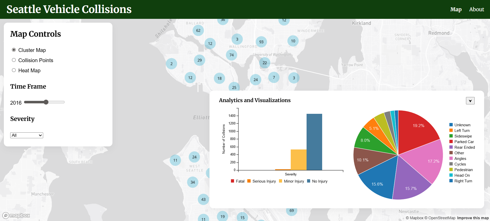
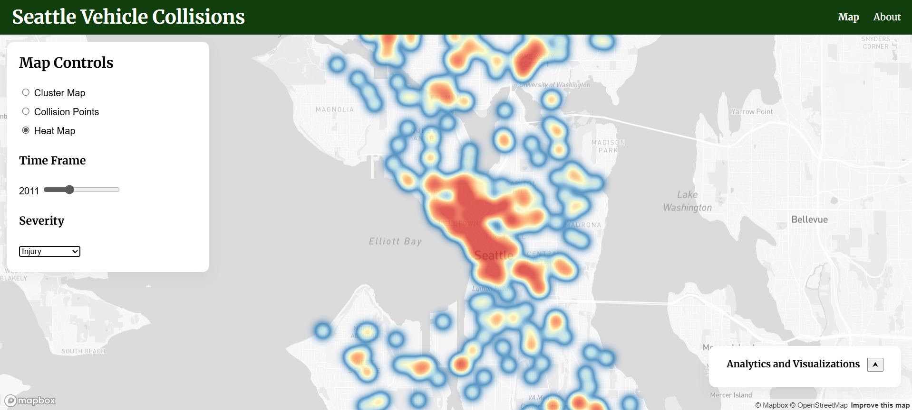

# Seattle Vehicle Collisions Dashboard

I used AI in this assignment for debugging only. I did not use AI to write or complete any components where AI use is prohibited. If AI was used for debugging or development, I am able to explain the relevant code and decisions.

## Project Website
Visit the project here:
https://jimenezboyz101.github.io/seattle_smart_dashboard/

---

## Team Members
Group 16 – GEOG 458: Advanced Digital Geographies
University of Washington

- Oswaldo Jimenez
- William McKinnie
- Lizbeth Sarabia
- Holly Stewart

---

## Project Description
Imagine being able to explore the streets of Seattle like never before. The **Seattle Vehicle Collisions Dashboard** is an interactive web-based visualization that lets you dive into the world of traffic collisions, exploring patterns and trends across the city from **2004–2026**.

With our dashboard, you can get up close and personal with collision data using multiple visualization modes, including **cluster maps**, **point maps**, and **heat maps**. But that's not all - we also provide a deeper look into the numbers behind the trends, giving you a summary of collision severity and collision type distribution.

By combining the power of spatial visualization with statistical summaries, our dashboard provides an intuitive way to investigate traffic safety patterns across the city. You'll be able to see the bigger picture, and gain a deeper understanding of how our streets are being used.

---

## Project Goal
The goal of this project is to help users better understand **traffic collision patterns and road safety in Seattle** as well as inform
policy makers of potential risk areas in the city.

Through this dashboard we aim to:

- Reveal **collision hotspots** across the city
- Explore **how collision patterns change over time**
- Analyze **collision severity and accident types**
- Provide insights that could help inform **transportation planning and safety improvements**

Ultimately, the project demonstrates how **interactive mapping and data visualization can support safer urban environments.**

---

## Project Features
The dashboard includes several interactive tools:

**Map Visualizations**
- Cluster Map showing concentrations of collisions
- Point Map displaying individual collision locations
- Heat Map highlighting collision density

**Interactive Filters**
- Year slider to explore collisions from **2004–2026**
- Severity filter to view:
  - Fatal collisions
  - Serious injuries
  - Minor injuries
  - All collisions

**Analytics Panel**
- Bar chart summarizing collision severity
- Pie chart showing collision type distribution

---

## Screenshots

### Cluster & Analytics Screenshot

### Heatmap & Non Severe Injury

---

## Data Sources
Collision data was obtained from the **Seattle Department of Transportation Open Data Portal**.

Seattle Department of Transportation Collision Dataset:
https://data-seattlecitygis.opendata.arcgis.com/

The dataset contains records of reported vehicle collisions including:

- Collision location
- Date and time
- Number of injuries
- Fatalities
- Collision type

Data was queried through the **ArcGIS REST API** and converted to **GeoJSON** for visualization.

---

## Libraries and Web Services

### JavaScript Libraries
- **Mapbox GL JS** – interactive web mapping
- **C3.js** – charting library built on D3

### Web Services
- **Mapbox** – basemap and map rendering
- **ArcGIS REST API** – collision dataset queries
- **GitHub Pages** – project hosting

---

## Technical Workflow
1. Collision data is queried from the **ArcGIS Feature Server**.
2. The data is returned as **GeoJSON**.
3. Mapbox renders spatial layers including clusters, points, and heatmaps.
4. Collision attributes are processed with JavaScript to generate charts using **C3.js**.
5. User interactions (filters, slider, map controls) dynamically update the map and charts.

---

## Acknowledgment
This project was developed for the final project of:

**GEOG 458: Advanced Digital Geographies**

Course instructor: **Bo Zhao**
